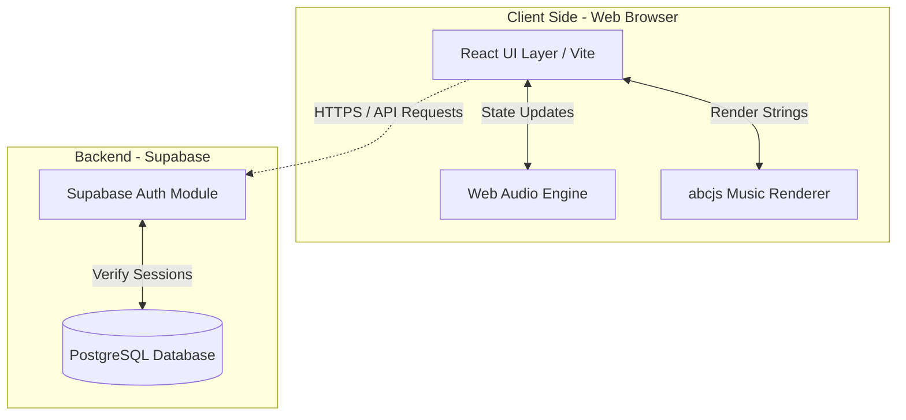

# 🎹 HarmoCraft

**Your best composition companion.**

- **Team Name:** HarmoCraft
- **Members:** Yap Guo Jie & Koh Jing Xuan
- **Targeted Level of Achievement:** Apollo 11

---

## Problem Motivation

Composition often feels like a black box for those without a formal background in music theory. The motivation here is to lower the barrier to entry. By building a tool that suggests chord progressions or correct harmonies based on a user's melody, the project acts as a training wheel for the creative process, helping musicians understand why certain notes sound good together.

## Aim

We hope to democratize music composition by building an intelligent piano companion that acts as training wheels for beginners. We aim to bridge the gap between playing notes and understanding theory by providing real-time visual feedback and harmonic suggestions, proving that anyone can be a composer.

## Core Features & User Stories (Milestone 1)

For our Milestone 1 Technical Proof of Concept, we focused on establishing the foundation for our core application features:

- **As a user,** I want to be able to securely log in so my compositions and progress are saved to my account. _(Implemented via Supabase Auth)_
- **As a beginner pianist,** I want to see my keyboard clicks appear on a digital staff, so I can learn to read and write music simultaneously. _(Workspace UI structure established)_
- **As an aspiring composer,** I want to hear my composition as I build it through real-time MIDI synthesis. _(Audio engine integrated via Web Audio API)_

---

## Architecture & Design Justification

To ensure HarmoCraft can scale to support complex AI integrations in future milestones, we implemented a **Component-Based Architecture** with strict separation of concerns.

### Current Tech Stack (Milestone 1)

- **Frontend (React + Vite):** Chosen for quick state updates required by the virtual piano.
- **Backend & Auth (Supabase):** Handles secure authentication and session management.
- **Audio Engine (Web Audio API & abcjs):** Native browser audio synthesis and dynamic sheet music rendering.

### Planned Integrations (Milestones 2 & 3)

- **AI/Algorithmic Engine:** We are currently evaluating LLM APIs or custom algorithms to power our "Smart Guide" note suggestion system for future iterations.

---

## UI / UX Prototype

### A. Secure Authentication

_Our landing page features conditional rendering and form validation, ensuring passwords meet length and matching criteria before pinging the database._

### B. User Dashboard

_The centralized routing hub. By utilizing React state (`currentView`), users can navigate between their profile and the composition workspace without full page reloads._

### C. Digital Workspace

_A custom flexbox layout designed to house the `abcjs` dynamic sheet music renderer and the interactive synthesizer keyboard._

---

## Software Engineering Practices

To ensure a stable codebase, our team adheres to the following practices:

- **Version Control:** We utilize Git and GitHub, employing a feature-branch workflow to prevent code collisions.
- **State-Based Routing:** We avoid messy URL routing by using a central "Traffic Cop" component (`App.jsx`) to manage application state securely.
- **Component Modularity:** Complex logic (like audio synthesis) is isolated into specific child components (`Workspace.jsx`) to prevent memory leaks and UI freezing on unrelated pages.

---

## How to Run Locally

_(Assuming a fresh development environment)_

### Prerequisites

1. **Node.js:** Download from [https://nodejs.org/](https://nodejs.org/) (LTS version).
2. **Git:** Download from [https://git-scm.com/](https://git-scm.com/).

### Installation Steps

1. Clone this repository: `git clone https://github.com/topinmys/HarmoCraft.git`
2. Navigate into the folder: `cd harmocraft`
3. Install dependencies: `npm install`
4. Start the server: `npm run dev`
5. Open your web browser and navigate to `http://localhost:5173`

_(For a detailed breakdown of our development timeline and weekly tasks, please refer to our attached Project Log document)._
